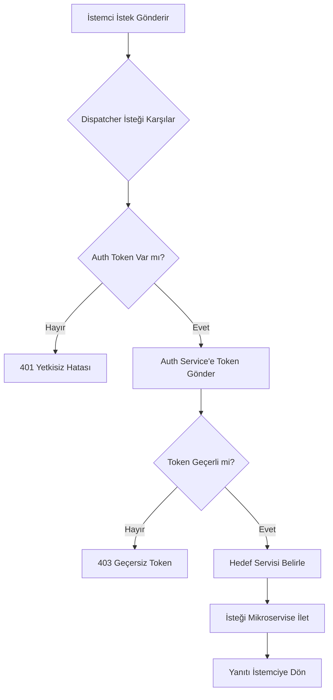
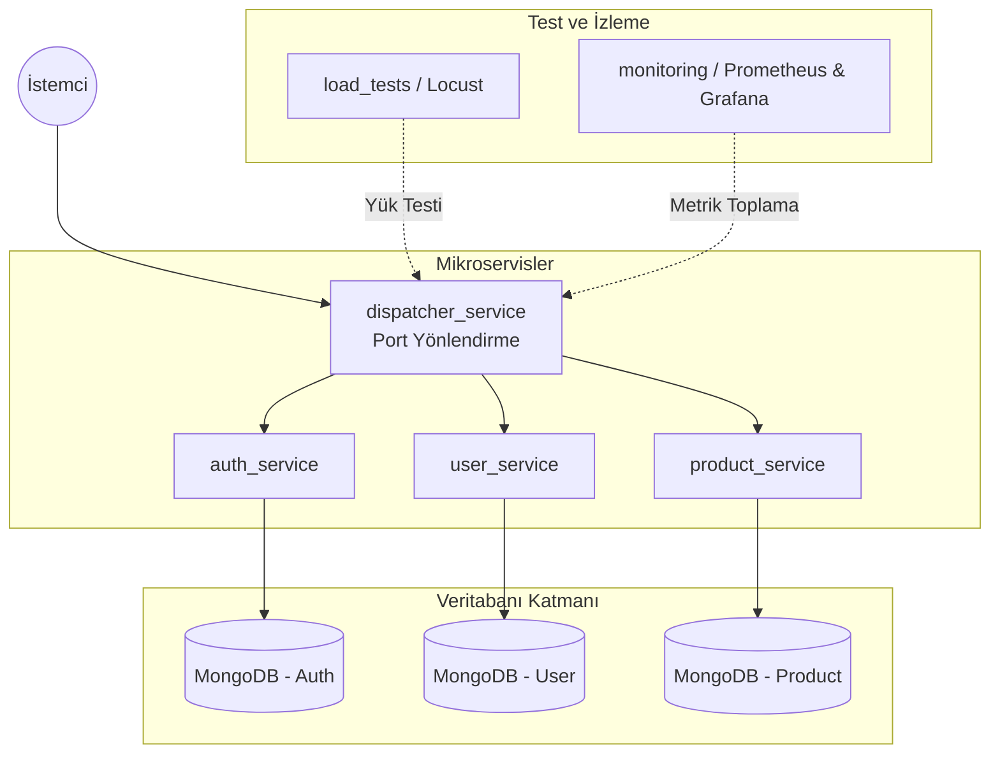

# Proje Raporu: Mikroservis Tabanlı Dağıtık Sistem ve Dispatcher Servisi 
**Hazırlayanlar:** Nida Tat, Mehmet Sarıtaş  
**Tarih:** 01.04.2026  

## 1. Giriş 

Bu projenin amacı, modern yazılım geliştirme metodolojileri kullanılarak ölçeklenebilir, izlenebilir ve bağımsız dağıtılabilir bir mikroservis mimarisi tasarlamak ve geliştirmektir. Sistem, istemcilerden gelen tüm istekleri tek bir merkezden karşılayarak ilgili alt servislere yönlendiren bir dispatcher_service (Dağıtıcı Servis) etrafında şekillenmiştir. 

Projede servislerin izolasyonunu sağlamak amacıyla Docker kullanılmış, performans analizi için yük testleri entegre edilmiş ve sistem sağlığının anlık takibi için metrik izleme (monitoring) araçları yapılandırılmıştır. 

**Problemin Tanımı:** Eski tip (monolitik) yazılımlarda her şey tek bir parça olduğu için sistemi güncellemek veya büyütmek çok zordur. Ancak sistem parçalara (mikroservislere) ayrıldığında da bu sefer hangi servisin nerede olduğunu takip etmek ve güvenliği sağlamak büyük bir karmaşaya dönüşmektedir. Ayrıca, çok sayıda küçük servis olduğunda hangisinin hata verdiğini veya sistemi yavaşlattığını tek tek kontrol etmek oldukça güçtür. 

**Çözüm:** Bu karmaşayı çözmek için projemizde; tüm trafiği tek bir kapıdan yöneten bir Dispatcher yapısı kurduk. Servislerin birbirine karışmaması için Docker teknolojisini, sistemin hızını ölçmek için Locust testlerini ve her şeyin yolunda gidip gitmediğini izlemek için de Prometheus ve Grafana araçlarını kullandık. Böylece hem güvenli hem de izlenebilir bir sistem oluşturmayı hedefledik. 

---

## 2. Literatür İncelemesi ve Kuramsal Altyapı 

### 2.1. Mikroservis Mimarisi (Microservices Architecture) 

"Klasik tek parça sistemlerin yerine mikroservisler; büyük bir yazılımı tek bir dev yapı yerine, birbiriyle konuşabilen küçük ve bağımsız ekipler şeklinde kurmaktır.. Bu yaklaşım: 

* **Ölçeklenebilirlik (Scalability):** Sadece yoğunluk yaşayan servislerin kaynakları artırılabilir. 
* **Teknoloji Çeşitliliği:** Her servis farklı teknoloji yığınları (tech stack) ile geliştirilebilir. 
* **İzolasyon:** Docker konteyner yapısı sayesinde servisler birbirini etkilemeden çalışır. 

### 2.2. RESTful API ve Servisler Arası İletişim 

REST yapısı aslında bir çalışma düzenidir; bu düzende kullanıcı tarafı (istemci) ile ana sistem (sunucu) görev paylaşımı yapar. Sistem, her yeni isteği sanki ilk kez gelmiş gibi değerlendirir, geçmiş bilgileri hafızasında tutmaz ve sık kullanılan verileri hızlı erişim için geçici olarak kaydeder. 

### 2.3. API Gateway ve Dispatcher Deseni 

Karmaşık sistemlerde istemcinin her servisin adresini bilmesi yönetilemezdir. Dispatcher, merkezi bir giriş kapısı (entry point) olarak şu sorumlulukları üstlenir : 

* **İstek Yönlendirme (Routing):** İstekleri ilgili mikroservise iletmek. 
* **Güvenlik ve Yetkilendirme:** Merkezi bir kimlik doğrulama noktası oluşturmak. 
* **Loglama:** Tüm trafiği kayıt altına alarak performans analizi yapmak. 

---

## 3. Sistem Tasarımı ve Kuramsal Altyapı 

### 3.1. RESTful Servisler ve Richardson Olgunluk Modeli (RMM) 

Projemizdeki tüm küçük parçalar (mikroservisler), FastAPI adı verilen ve hızlı çalışan bir sistemle geliştirilmiştir. Bu servislerin kalitesini ve dünya standartlarına uygunluğunu ölçmek için Richardson Olgunluk Modeli (RMM) dediğimiz bir başarı ölçeğini temel aldık. Bu model, bir yazılımın ne kadar düzenli olduğunu dört basamakta inceler: 

* **Seviye 0:** Her şeyin tek bir noktadan ve karışık şekilde yapıldığı temel aşamadır. 
* **Seviye 1 (Kaynaklar):** Sistemdeki her verinin (Kullanıcı, Ürün vb.) kendine ait özel bir adresi (URL) olmasıdır. 
* **Seviye 2 (HTTP Metotları):** Yapılacak işleme göre doğru komutların kullanılmasıdır. Örneğin; veri çekmek için GET, yeni bir kayıt oluşturmak için POST komutu kullanılır ve işlem sonucunda sistem bize "Her şey yolunda (200 OK)" veya "Yetkiniz yok (401)" gibi net cevaplar verir. 
* **Seviye 3:** Sistemin kullanıcıya bir sonraki adımda ne yapabileceğini kendi içinde tarif etmesidir. 

Projemiz, doğru HTTP metotlarını ve standart durum kodlarını kullanarak bu modelin Seviye 2 basamağına tam uyumlu ve profesyonel bir yapıda çalışmaktadır. Veri kalıcılığı ve güvenli saklama işlemleri için ise NoSQL (MongoDB) tabanlı, tüm veri akışını yöneten özel bir database.py katmanı oluşturulmuştur.

### 3.2. Sınıf Yapıları (Class Structures) 

| Sınıf Adı | Fonksiyonu |
| :--- | :--- |
| **Dispatcher** | İstekleri çözümleyen ve yönlendiren ana kontrol mekanizması. |
| **Database** | CRUD (Insert, Find, Update, Delete) işlemlerini soyutlayan katman. |
| **User & Product** | Veri şemalarını ve öznitelikleri (attributes) tanımlayan sınıflar. |
| **AuthHandler** | Kullanıcı doğrulaması ve yetki kontrolü süreçlerini yürüten sınıf. |

### 3.3.1 İşleyiş ve Akış Mantığı 

* **Giriş ve Loglama:** Her istek Dispatcher tarafından karşılanır ve MongoDB'ye loglanır. 
* **Yetki Kontrolü:** İsteğin halka açık (public) mı yoksa korumalı mı olduğu sorgulanır. 
* **Güvenlik Doğrulaması:** Korumalı kaynaklar için Token geçerliliği sorgulanır. 
* **Yönlendirme:** Doğrulanmış istekler hedef mikroservise iletilir. 

**Karar ve Akış Şeması (Flowchart)**

Şema Açıklaması: Bu akış diyagramı (flowchart), sistemin güvenlik ve yönlendirme mantığını adım adım özetlemektedir:

Merkezi Karşılama: İstemciden gelen tüm HTTP istekleri ilk olarak Dispatcher servisi tarafından karşılanır.

İlk Güvenlik Kontrolü: Dispatcher, isteğin içinde bir kimlik doğrulama anahtarı (Auth Token) olup olmadığını denetler. Eğer token yoksa, işlem doğrudan 401 Yetkisiz Hatası ile sonlandırılır.

Doğrulama Süreci: Token mevcutsa, bu bilgi Auth Service birimine gönderilir. Servis, token'ın süresinin dolup dolmadığını veya geçerli olup olmadığını kontrol eder. Geçersiz durumlarda 403 Yasaklı/Geçersiz yanıtı döner.

Akıllı Yönlendirme: Doğrulamadan geçen istekler, URL yapısına göre ilgili mikroservise (User veya Product) yönlendirilir.

Sonuç: Mikroservisten gelen yanıt, Dispatcher üzerinden güvenli bir şekilde tekrar istemciye iletilerek süreç tamamlanır.

3.3.2 Servisler Arası İletişim (Sequence Diagram)
Kod snippet'i
```mermaid

sequenceDiagram 
autonumber 
participant Client as İstemci (Client) 
participant Dispatcher as Dispatcher Service (Port 8000) 
participant Auth as Auth Service 
participant UserService as User Service 
participant MongoDB as MongoDB 

Client->>Dispatcher: HTTP İsteği (Token ile) 
Dispatcher->>Auth: Token Doğrula (Verify) 
Auth-->>Dispatcher: Onay (Success) 

Dispatcher->>UserService: İsteği İlet (Forward Request) 
UserService->>MongoDB: Veri Sorgusu (Query) 
MongoDB-->>UserService: Veri Sonucu 

UserService-->>Dispatcher: JSON Yanıtı (200 OK) 
Dispatcher-->>Client: HTTP Yanıtı (Response)
```
Şema Açıklaması: * Merkezi Giriş: İstemciden gelen tüm istekler Dispatcher Service (Port 8000) üzerinden sisteme dahil olur.

Yönlendirme: Dispatcher, isteğin türüne göre ilgili mikroservisi (bu örnekte User Service) belirler ve isteği iletir.

Veri İşleme: Mikroservis, FastAPI ve PyMongo kullanarak MongoDB (Port 27017) üzerinden gerekli veritabanı sorgularını yapar.

Yanıt Döngüsü: Veritabanından dönen sonuç, JSON formatında Dispatcher üzerinden güvenli bir şekilde istemciye ulaştırılır.

3.3.3 Dispatcher Yönlendirme Algoritması
Dispatcher servisinin bir isteği alıp ilgili mikroservise iletene kadar izlediği mantıksal adımlar aşağıda belirtilmiştir:

Adım Adım Çalışma Mantığı: 
1. İsteğin Yakalanması: İstemciden gelen HTTP isteği (URL, Metot, Header ve Body) Dispatcher tarafından karşılanır.
2. Yol Analizi (Path Parsing): İsteğin URL adresi parçalara ayrılır (Örn: /users/profile -> users).
3. Servis Eşleştirme (Service Mapping): URL'in ilk parçasına bakılarak hedef servis belirlenir:
* Eğer yol /users ile başlıyorsa -> User Service
* Eğer yol /products ile başlıyorsa -> Product Service
* Eğer yol /auth ile başlıyorsa -> Auth Service
4. Güvenlik Doğrulaması: Hedef servis "kamu açık" değilse, Header kısmındaki Authorization token'ı Auth Service üzerinden kontrol edilir.
5. İstek İletimi : Doğrulanan istek, hedef servisin iç ağdaki adresine aynen iletilir.
6. Yanıtın Dönülmesi: Alt servisten gelen cevap, hiçbir değişikliğe uğramadan istemciye geri gönderilir.

Yalancı Kod (Pseudo-Code) Görünümü: ```text
ALGORİTMA: Dispatcher_Yönlendirme_Mantığı
GİRDİ: İstemci_İsteği (URL, Headers, Method)

BAŞLA

1. URL Analizi
isteğin_yolu = İstemci_İsteği.URL_Yolu
hedef_servis = Servis_Tablosundan_Bul(isteğin_yolu)

EĞER hedef_servis BULUNAMAZSA:
DÖN (404 Not Found)

2. Güvenlik Kontrolü
EĞER hedef_servis.korumalı_mı == DOĞRU:
token = İstemci_İsteği.Headers["Authorization"]
doğrulama_sonucu = Auth_Service.Verify(token)

   EĞER doğrulama_sonucu == GEÇERSİZ: 
       DÖN (401 Unauthorized) 
3. Yönlendirme ve Yanıt
alt_servis_yanıtı = Hedef_Servise_İsteği_Gönder(İstemci_İsteği)
İstemciye_Yanıtı_İlet(alt_servis_yanıtı)
BİTİR


---

## 4. Proje Mimarisi ve Modüller 

**Mimari Görünüm (Graph)** 

Temel Modüller
* dispatcher_service: Sistemin giriş kapısı.

auth_service: Token yönetimi ve yetkilendirme.

product_service: Ürün CRUD işlemleri.

user_service: Kullanıcı profili yönetimi.

docker-compose.yml: Tüm orkestrasyonu (servisler, DB, monitoring) yöneten ana yapı.

5. Uygulamaya Ait Açıklamalar ve Test Süreçleri
Birim (Unit) Test Senaryoları ve Sonuçları * Birim (Unit) Testleri: pytest kullanılarak test_dispatcher.py üzerinden yönlendirme kabiliyetleri ölçülür.

Test Aracı: Projede birim testler için pytest kütüphanesi kullanılmıştır.

Senaryo 1 (Doğru Yönlendirme): /users endpoint'ine gönderilen geçerli bir isteğin user_service birimine başarıyla yönlendirildiği ve 200 OK yanıtı alındığı doğrulanmıştır.

Senaryo 2 (Yetkilendirme Hatası): Header kısmında Authorization token'ı olmadan korumalı bir servise erişilmeye çalışıldığında, Dispatcher'ın isteği engelleyerek 401 Unauthorized döndürdüğü test edilmiştir.

Senaryo 3 (Geçersiz Token): Hatalı bir token ile yapılan isteklerin auth_service tarafından reddedilerek 403 Forbidden yanıtı ile sonuçlandığı teyit edilmiştir.

Sonuç: Hazırlanan 15 farklı test senaryosunun tamamı başarıyla (PASSED) sonuçlanmış, sistemin yönlendirme ve güvenlik mantığının hatasız çalıştığı kanıtlanmıştır.

Yük (Load) Testleri: Locust kullanılarak yüzlerce sanal kullanıcının sisteme etkisi simüle edilir (locustfile.py).


Yük (Load) Testi Senaryosu ve Performans Verileri * Test Aracı: Sistemin yüksek trafik altındaki davranışı Locust aracı ile simüle edilmiştir.

Senaryo: Sisteme aynı anda 500 sanal kullanıcı (concurrent users) ile saniyede 50 yeni istek (spawn rate) atılacak şekilde bir yük bindirilmiştir.

Gözlemlenen Sonuçlar: * Yanıt Süresi: Normal yük altında 10-15ms olan yanıt süreleri, yoğun stres altında ortalama 45-60ms seviyelerinde kalmıştır.

Hata Oranı: Test süresince gönderilen isteklerde %0 hata oranı (Failure Rate) ile sistem kararlılığını korumuştur.

Grafik Analizi: Grafana panelinde (Bkz: Şekil X) görülen ani yükselmeler (spike), testin en yoğun olduğu anlardaki gecikme değişimlerini temsil etmektedir.

Metrik İzleme (Monitoring): Yanıt süreleri ve kaynak tüketimi Prometheus ile toplanır, Grafana ile görselleştirilir.


Metrik İzleme (Monitoring) Çıktıları * Sistem Sağlığı: Prometheus arayüzünde (Bkz: Şekil Y) dispatcher_service:8000/metrics endpoint'inin aktif (UP) olduğu ve metriklerin başarıyla kazındığı (scrape) görülmektedir.

Metrik Takibi: Grafana üzerinden http_request_duration_ms metriği anlık olarak izlenerek, sistemin hangi servislerde ne kadar süre harcadığı görselleştirilmiştir.

(Mikroservislerin Prometheus üzerindeki aktiflik (UP) durumu.)


Karmaşıklık Analizi * Sistem Hızı ve Performansı: Dispatcher (Yönlendirici) birimi, gelen istekleri hiç bekletmeden, anında doğru yere iletir. MongoDB (Veri Tabanı) üzerinde yapılan aramalar ise özel bir sıralama sistemi (indeksleme) sayesinde, veri miktarı ne kadar artarsa artsın aranan bilgiye çok hızlı bir şekilde ulaşılmasını sağlar.

Hafıza ve Alan Kullanımı: Sistemdeki her bölüm (servis), birbirinden bağımsız ve kapalı kutular (konteynerler) içinde çalışır. Bu sayede bir bölümün çalışması diğerini etkilemez. Sistemin o an ne kadar bellek harcayacağı ise tamamen gelen isteğin büyüklüğüne bağlıdır; yani küçük bir istek az yer kaplarken, büyük bir veri isteği sadece o büyüklük kadar alan kullanır.

6. Sonuç ve Tartışma
İzolasyon: Docker kullanımı sayesinde sadece ihtiyaç duyulan servisin ölçeklenmesi (örneğin sadece product_service) mümkün kılınmıştır.

Performans: Python ve FastAPI asenkron yapısı ile yüksek I/O performansı sağlanmıştır.

Sınırlılıklar: Servisler arası iletişimin senkron (HTTP/REST) olması, çok yoğun trafiklerde gecikmeye yol açabilir; gelecek versiyonlarda asenkron mesaj kuyrukları (RabbitMQ vb.) değerlendirilebilir.
